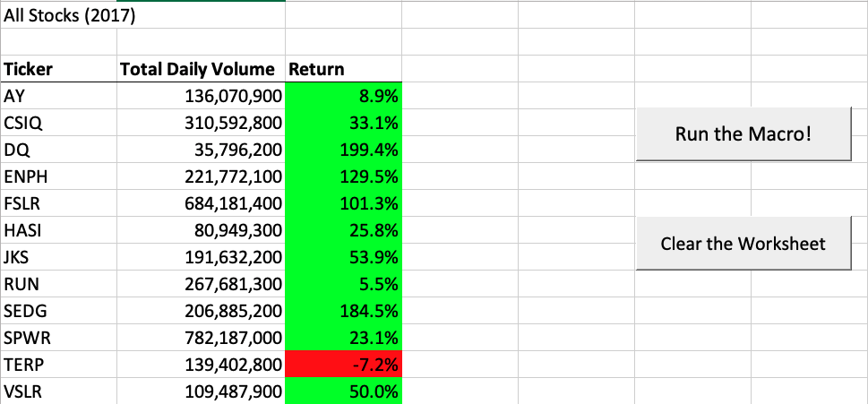
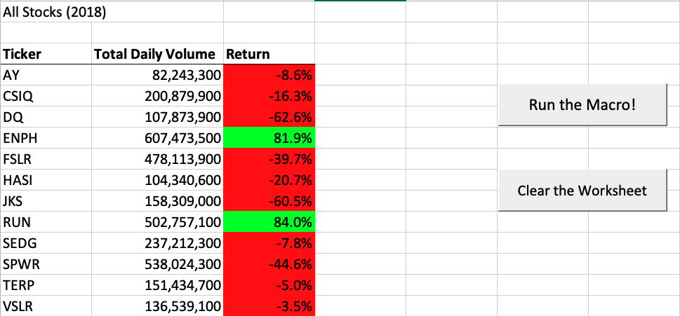
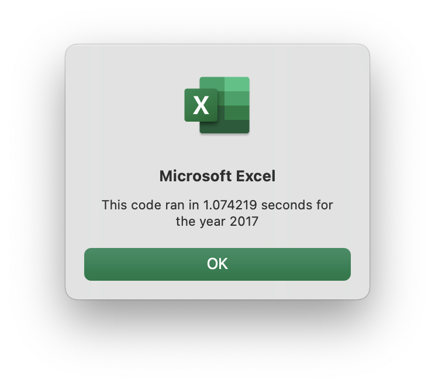
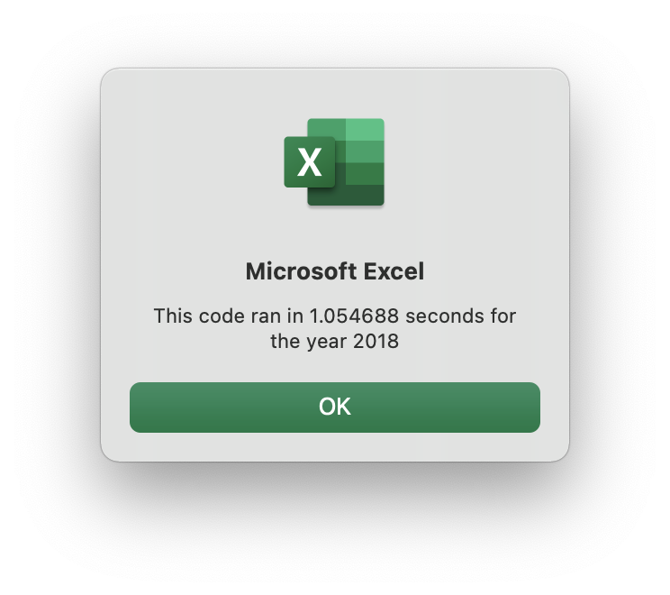

# Week 2 Challenge

## Overview of the Project
This project required us to refactor some VBA code for our stock analysis. Refactoring the code will allow us to make our code more efficient, take less memory and fewer steps. All 3 things tied together make it very possible for code to run faster and smoother. 

## Results 
I began the analysis by renaming the original dataset and adding the .vbs script to the Excel Visual Basic editor file. In order to loop through all the tickers we needed to create a ticker index to access all the tickers. We needed to hold the data associtaed with each ticker so we utilized arrays. For loops were heavily utilized as they made it easier to access all the data with single lines of code. If-Then statements were also used to ensure that we were able to have the correct starting and ending price for each ticker. 
    
From the results we can see that in 2017 was a good time to invest in any of the listed tickers with the exception of TERP. 
    


Unfortunately we cannot say the same for 2018. As most stocks were in the red :( 



Here are the run times for the two different cases:
    





## Summary
Another new experience in refactoring code. There were few challenges in debugging and finding a way to intialize my array properly. I was able to get help from Stack overflow 
    
```
For j = 2 To RowCount
    
       
            If Cells(j, 1).Value = tickerIndex Then
            
                tickerVolumes = tickerVolumes + Cells(j, 8).Value
                
            End If
```


### Advantages & Disadvantages of Refactoring Code in General 
#### Advantages 
1. Refactoring Improves the Design of Software
1. Refactoring Makes Software Easier to Understand
1. Refactoring Helps Finding Bugs
1. Refactoring Helps Programming Faster

#### Disadvantages
1. It's risky when the application is big
1. It's risky when the existing code doesn't have proper test cases
1. It's risky when developers do not understand what's all about
    
### Advantages & Disadvantages of Refactoring Code in VBA
#### Advantages 
1. Allows our code to run faster 
1. Improves the efficiency of our code
1. Improves the readability of our code

#### Disadvantages
1. Very hard to debug refactored code on VBA 
1. Can make the code difficult to understand 
1. If not done well can make the code run longer
